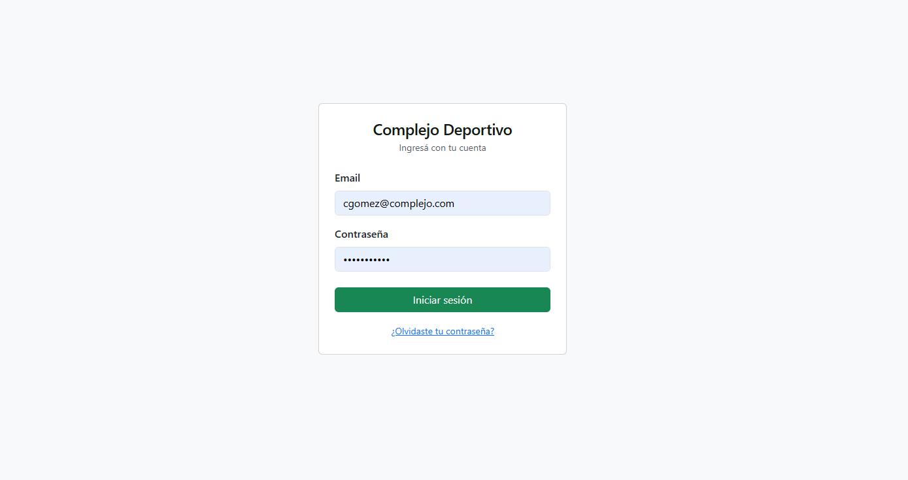
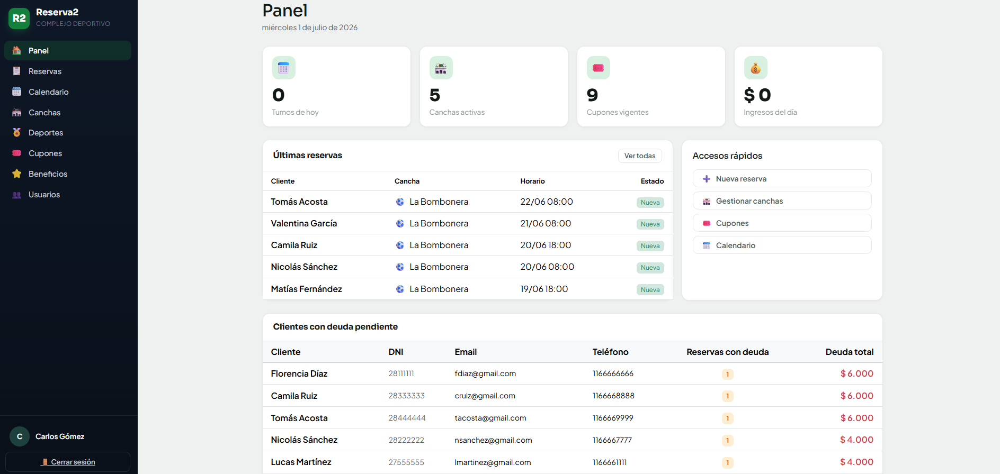
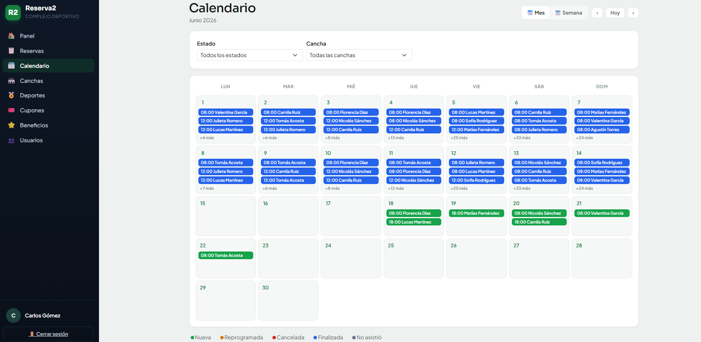
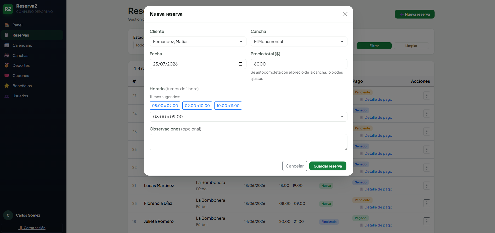
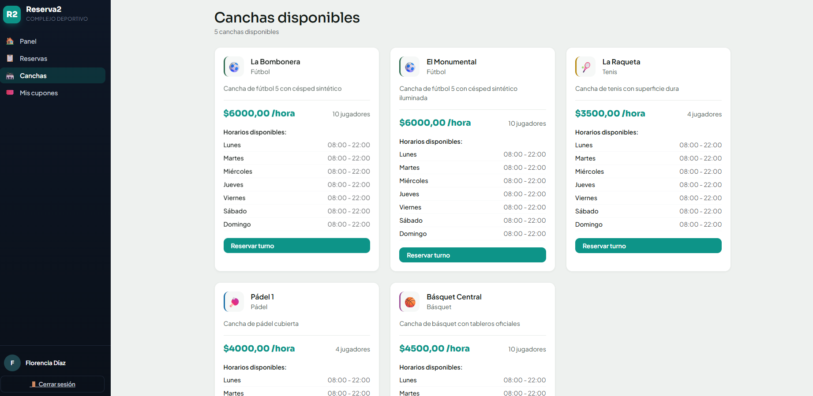
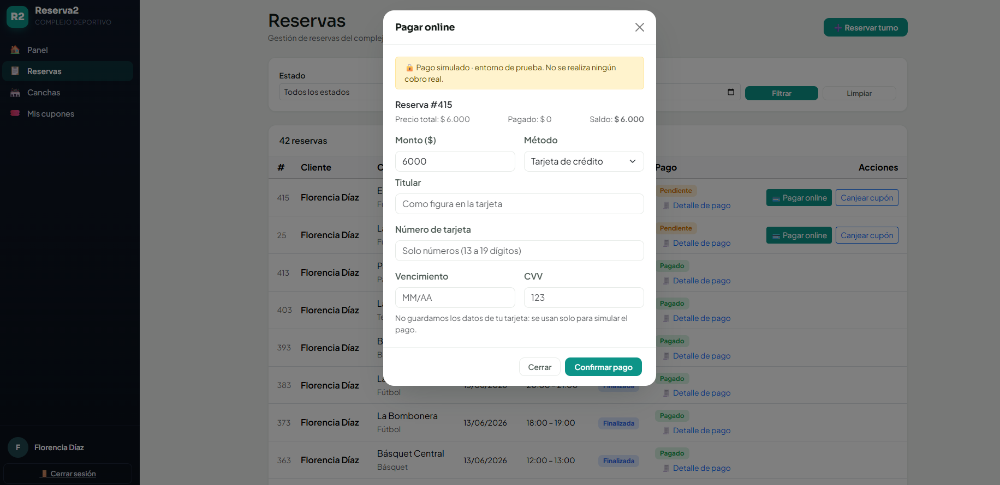
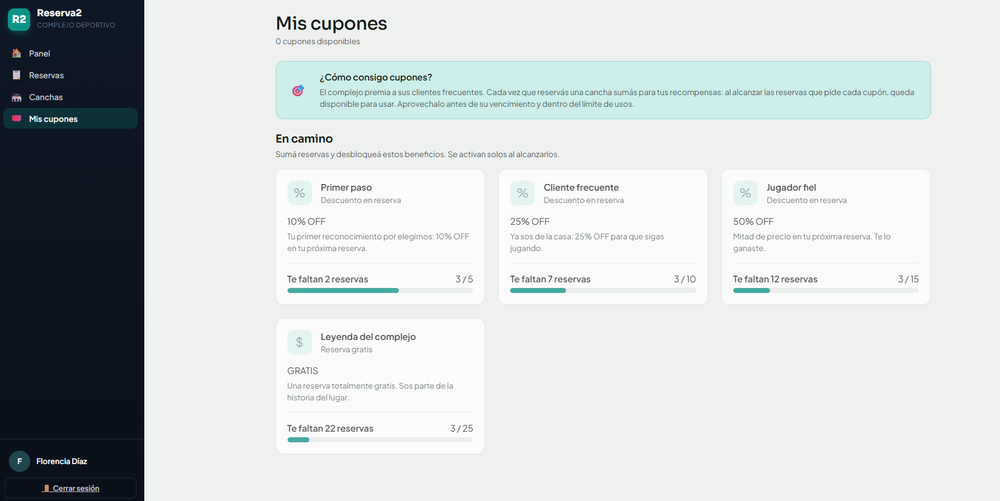

# Complejo Deportivo — Sistema de Gestión

Proyecto de la materia **Programación III** — Tecnicatura Universitaria en Programación. Universidad Tecnológica Nacional, Facultad Regional General Pacheco (UTN FRGP). Equipo 22A.

## Equipo

| Legajo | Integrante |
|--------|------------|
| 30963 | Ferreyra, Facundo Agustín |
| 33221 | Medina, Ángel Gabriel |
| 26038 | Oliveres, Tomás |

---

Aplicación web para administrar un complejo deportivo: reservas de canchas, clientes, cupones de fidelidad y todo el trabajo diario del staff, desde un mismo lugar.

---

## Qué hace

El complejo tiene varias canchas de distintos deportes (fútbol, tenis, pádel, básquet) que se alquilan por turno. La app cubre las dos puntas de esa operación.

**Del lado del staff**, el personal gestiona las reservas desde un calendario y administra todo lo que hay detrás: canchas, deportes, cupones y usuarios. También lleva el control de los pagos —cada reserva puede cobrarse con una seña y saldarse después, así que la app siempre sabe cuánto se pagó y cuánto falta— y sigue el ciclo de vida de cada turno: nuevo, reprogramado, cancelado, finalizado o marcado como ausente. Cada persona entra con su rol (Administrador, Recepcionista o Encargado de Cancha) y ve solo lo que le corresponde.

**Del lado del cliente**, cualquiera puede registrarse, iniciar sesión y reservar un turno por su cuenta sin depender de que lo atiendan por teléfono. Desde su panel ve sus próximos turnos, sus cupones y lo que adeuda; puede reprogramar una reserva, editar sus datos de perfil y hasta pagar online con tarjeta.

Uno de los pilares del sistema es el programa de **fidelidad**. La idea es simple: al cliente que vuelve, se lo premia. Cada vez que alcanza cierta cantidad de reservas, la base de datos le genera un cupón de descuento y lo deja guardado en su cuenta. A partir de ahí el cupón queda a la espera: cuando el cliente solicita una nueva reserva, puede canjearlo y el descuento se aplica sobre el total. La generación es automática, pero el canje siempre queda en manos del cliente.

El staff cuenta además con un **tablero** que resume el negocio de un vistazo: los turnos y los ingresos del día, un mapa de calor con la ocupación por turno y día de la semana, las canchas menos usadas y los clientes con deuda pendiente. La app no se limita a guardar datos: los devuelve convertidos en información para decidir.

Y hay varios detalles pensados para el uso diario. Los listados largos se pueden filtrar: las canchas por deporte y por estado (disponible o en mantenimiento), los cupones por tipo de descuento y por estado, y las reservas por cancha, fecha y estado. Los formularios no dejan guardar información incompleta o mal cargada, avisan del error en el momento. Y cada deporte tiene su ícono, así las pantallas se leen de un vistazo.

---

## Stack

| Capa | Tecnología |
|------|-----------|
| Frontend / Backend | ASP.NET Web Forms (.NET Framework 4.8) |
| Lenguaje | C# |
| Base de datos | SQL Server (Express) |
| Acceso a datos | ADO.NET (sin ORM) |
| Arquitectura | Tres capas (Dominio / Negocio / Presentación) |

---

## Arquitectura

La solución está partida en **tres proyectos**, cada uno con un trabajo bien definido:

| Proyecto | Qué contiene |
|----------|--------------|
| `Dominio` | Las clases que modelan el negocio (`Reserva`, `Cancha`, `Cupon`, `Usuario`...) y los `Enums`. No depende de nadie. |
| `Negocio` | Las reglas de negocio y el acceso a la base (`AccesoDatos`, `NegocioReservas`, `NegocioCupones`...). Depende solo de `Dominio`. |
| `WebApp` | Las páginas `.aspx` y su code-behind: lo que ve y toca el usuario. Depende de `Negocio` y `Dominio`. |

La regla de las dependencias es simple: **se mira siempre hacia adentro**. `Dominio` no conoce a nadie, `Negocio` conoce a `Dominio`, y `WebApp` los conoce a los dos. Ninguna página tiene una línea de SQL suelta: todo pasa por la capa de negocio.

---

## Cómo levantarlo

### Requisitos

- Visual Studio 2022 **17.13 o superior** (con la carga de trabajo **ASP.NET y desarrollo web**). La versión reciente importa: la solución usa el formato `.slnx`, que las versiones más viejas de Visual Studio no abren.
- .NET Framework 4.8
- SQL Server Express (o cualquier instancia de SQL Server)
- SQL Server Management Studio (opcional, para restaurar la base cómodo)

### 1. Clonar el repo

```bash
git clone https://github.com/atomdev1/PR3-TPC-EQUIPO22A.git
```

### 2. Crear la base de datos

En SQL Server Management Studio (o con `sqlcmd`), ejecutá el script completo que está en `docs/`:

```
docs/Setup_BD_Completo.sql
```

Ese script crea la base `BBDD2_TPI_GRUPO45` de cero: tablas, vistas, procedimientos almacenados, el trigger de fidelidad y los datos de prueba. No hace falta correr nada más.

> El nombre `BBDD2_TPI_GRUPO45` no es un error: es la misma base que desarrollamos para el trabajo integrador de **Bases de Datos 2** (Grupo 45). Las dos materias trabajan sobre el mismo modelo, por eso conserva ese nombre.

Con `sqlcmd`, por ejemplo:

```bash
sqlcmd -S .\SQLEXPRESS -i docs/Setup_BD_Completo.sql
```

### 3. Configurar la cadena de conexión

La cadena está en `WebApp/Web.config`, bajo `connectionStrings`:

```xml
<add name="ComplejoDep"
     connectionString="Server=.\SQLEXPRESS;Database=BBDD2_TPI_GRUPO45;Integrated Security=True;" />
```

Si tu instancia de SQL Server no se llama `.\SQLEXPRESS`, cambiá el `Server` por el nombre de la tuya. El resto queda igual.

### 4. Compilar y correr

Abrí `PR3-TPC-EQUIPO22A.slnx` en Visual Studio, dejá `WebApp` como proyecto de inicio y presioná **F5**. Se levanta en IIS Express y abre el login.

---

## Usuarios de prueba

El script de la base ya deja usuarios cargados para cada rol. **La contraseña de todos es `password123`.**

| Rol | Email |
|-----|-------|
| Administrador | `cgomez@complejo.com` |
| Recepcionista | `mlopez@complejo.com` |
| Encargado de Cancha | `rsilva@complejo.com` |
| Cliente | `lmartinez@gmail.com` |

> El Administrador es el que más ve: entrá con ese para recorrer todo el sistema. Con el cliente probás la autogestión (reservar, reprogramar, cupones).

---

## Capturas

### Ingreso



*Pantalla de login, común a todos los roles.*

### Del lado del staff



*El panel principal que ve el personal al ingresar.*



*El calendario donde el staff gestiona los turnos del día.*



*Carga de una reserva desde el mostrador.*

### Del lado del cliente



*El cliente explora las canchas y reserva por su cuenta.*



*Pago de la reserva con tarjeta, sin pasar por el mostrador.*



*Los cupones de fidelidad que el cliente fue ganando.*

---

## Estructura del repo

```
PR3-TPC-EQUIPO22A/
├── Dominio/                    # Clases del modelo + Enums
├── Negocio/                    # Reglas de negocio + acceso a datos (ADO.NET)
├── WebApp/                     # Páginas .aspx + code-behind (presentación)
│   └── Web.config              # Cadena de conexión y configuración
├── docs/                       # Script de la base, diagramas y capturas
│   ├── Setup_BD_Completo.sql   # Crea la base entera de cero
│   ├── DER_ComplejoDep.png     # Diagrama entidad-relación
│   ├── modelo-dominio.png      # Modelo de clases del dominio
│   └── screenshots/            # Capturas usadas en este README
└── PR3-TPC-EQUIPO22A.slnx      # Solución de Visual Studio
```

---

## Diagramas

- **Entidad-relación de la base:** [`docs/DER_ComplejoDep.png`](docs/DER_ComplejoDep.png)
- **Modelo de dominio (clases):** [`docs/modelo-dominio.png`](docs/modelo-dominio.png)

---

## Cómo se construyó

El proyecto se desarrolló de forma incremental, en las etapas que fue proponiendo la cátedra. Cada una construía sobre la anterior:

- **Etapa 1 — Estructura.** El modelo de dominio (arquitectura de clases), el armado de las pantallas sin funcionalidad (solo navegación y controles) y la primera lectura de datos desde la base.
- **Etapa 2 — ABMs y listados.** Altas, bajas, modificaciones y listados de las entidades administrables (canchas, deportes, usuarios), dejando el core para más adelante. También se reforzaron las validaciones y el diseño.
- **Etapa 3 — El core.** La funcionalidad central: reservar un turno y reprogramarlo, más las funciones de valor agregado (registrarse, recuperar contraseña, búsquedas dinámicas), con validaciones a lo largo de la app.
